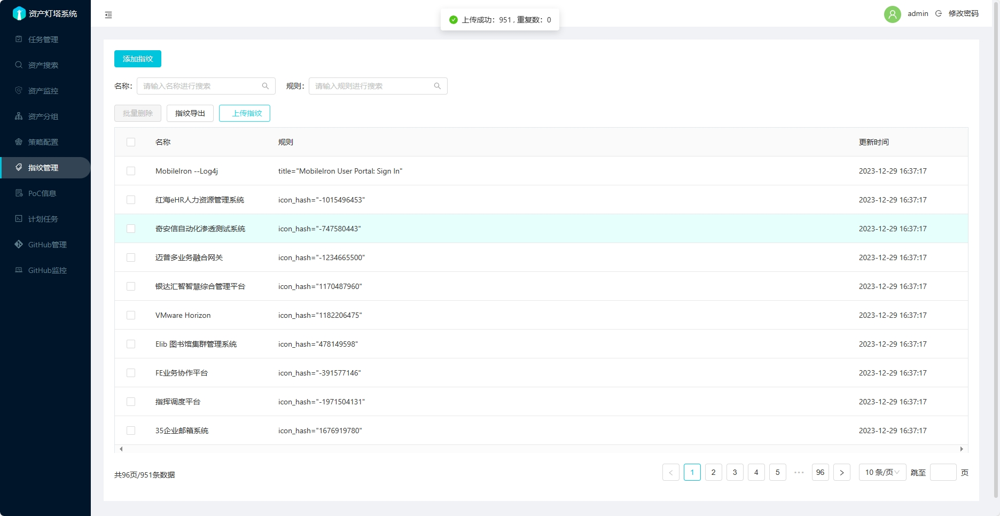

## EHole(棱洞) 规则转换为 ARL 指纹


## ARL 指纹规则语法

适配版本： ARL v2.6.1

支持`body`, `title`, `header`, `icon_hash` 四个字段, 可以用`（）`进行分组

支持的操作符有 `=`, `==`, `&&`, `||`, `!`

如 `body="Powered by WordPress" || body="<meta name=\"generator\" content=\"WordPress"`


| 操作符       | 说明                               | 举例                   |
| ------------ | ---------------------------------- | ---------------------- |
| =       |     字符串是否包含         | body = "test"  |
| ==     | 字符串是否相等             | title == "登录" |
| &&       | 判断两个值是否都为真               | body = "test1" && body = "tes2" |
| &#x7c;&#x7c;  |  判断两个值是否至少有一个为真               | body = "test1" &#x7c;&#x7c; body = "tes2" |
| !       | 对一个值进行逻辑非操作               | !(body = "test")   |


## 规则转换 

```shell
python3 main.py
```

## 直接食用

登陆 ARL -> 指纹管理 -> 上传指纹 -> 选择 finger.yml -> 上传



